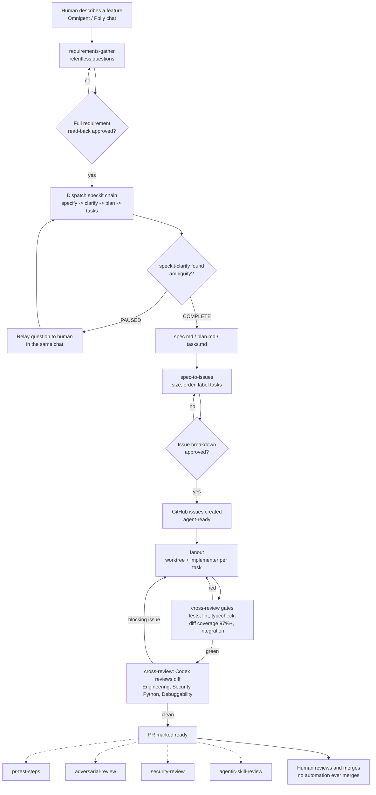

# agent-dev-kit

A spec-first, small-PR, cross-vendor-reviewed workflow for getting AI coding
agents to do real work under human review — plus a working reference
implementation of that workflow on top of
[Omnigent](https://github.com/omnigent-ai/omnigent) and its Polly
orchestrator.

## Trust model — read this before adopting

"Cross-vendor reviewed" and "human-gated merge" describe the *review and
merge* gates, not a sandbox. **This workflow does not run untrusted agents in
a sandbox by default.** As shipped, every *implementer* sub-agent bundle in
`agents/` (`claude_code`/`codex`/`opencode`/`cursor`/`hermes`/`agy`) runs with
the caller's full process environment (`os_env: { type: caller_process,
sandbox: { type: none } }`), and several individual settings deliberately
widen that further:

- `permission_mode: auto` (`claude_code`) and `yolo: true` (`cursor`) —
  headless workers can't answer interactive approval prompts, so these
  auto-approve actions rather than blocking on a human who isn't there.
- `gate_pushes: false` (every implementer bundle, and the root
  `config.yaml`) — implementers push branches and open PRs unattended; only
  the catastrophic `blast_radius` set (force-push, `rm -rf /`, hard-reset to
  a remote ref) is still denied.
- `spawn: true` (root `config.yaml`) — Polly can launch additional
  self-defined child sessions beyond the declared roster.

`pi` is the one exception, matching its narrower review/explore/search-only
role: it runs under a real OS sandbox (`os_env.sandbox.type: auto` — resolves
to `linux_bwrap`/`darwin_seatbelt`), which mounts its worktree read-only at
the kernel level, and `gate_pushes: true` with `risky_action: DENY` — Pi
never opens a PR, so push/merge/deploy are denied outright rather than
allowed or even asked for. **Read "Known limitations" below before trusting
that sandbox** — it does not hold on every host or in every failure mode.

### Known limitations (`pi`'s sandbox specifically)

- **Fails open on setup failure, not closed.** In the installed Omnigent
  version this repo targets (0.10.0), `PiExecutor._try_sandbox_pi()` catches
  `OSError`/`ImportError`/`NotImplementedError` raised while constructing the
  sandbox (e.g. the `bwrap` (Linux) / `sandbox-exec` (macOS) binary missing,
  or SBPL/profile generation failing for any reason) and silently falls back
  to running Pi **completely unsandboxed**, logging only a warning
  (`"Could not apply sandbox for Pi: ..."`). This is upstream Omnigent
  behavior — there is no `require_sandbox` flag or config-level startup hook
  in this version that `agents/pi/config.yaml` can use to force that path to
  fail closed instead. `tests/test_pi_guardrails.py` includes a test that
  forces this exact failure and asserts on the current (fail-open) result,
  specifically so an Omnigent upgrade that changes this behavior gets
  noticed instead of silently assumed. Compensating controls, since the
  bundle can't force this on its own:
  - Verify `bwrap` / `sandbox-exec` is actually installed on every host that
    runs this bundle *before* trusting Pi's sandbox to hold — the resolver
    fails at spawn time, not at config-validation time, so a missing binary
    won't show up until Pi's first turn.
  - Monitor Pi's session/process logs for the "Could not apply sandbox for
    Pi" warning and treat its appearance as a critical incident (Pi ran a
    task fully unsandboxed).
  - Pi's own prompt (`agents/pi/config.yaml`) includes a best-effort
    self-check: its first action every task is to attempt a disposable
    write and abort with a critical report if it unexpectedly succeeds.
    This depends on the model actually running the check and reporting
    honestly — it is a soft signal, not a hard guarantee, and does not
    substitute for the two mitigations above.
- **No real enforcement on Windows.** `os_env.sandbox.type: auto` resolves
  to `windows_jobobject` there, which (per its own Omnigent docstring)
  provides process-tree containment only — filesystem and network
  isolation are **not enforced**. Pi's write-protection guarantee in this
  bundle is macOS/Linux-only; don't rely on it on a Windows host.

None of this is an oversight — it's what makes autonomous, unattended
dispatch across seven coding vendors actually work. But it means an agent in
this workflow is executing repo content (and, once wired to GitHub issues,
*issue* content — text anyone with issue-creation access can write) with
host-level process access and no default sandbox boundary. Treat that
content as untrusted input to a fairly privileged process. Concretely:

- Run this on a disposable VM, container, or an account with no credentials
  or secrets you wouldn't hand to code you haven't read — not on a
  workstation with your primary SSH keys, cloud credentials, or password
  manager unlocked in the same environment.
- Prefer running each *implementer* worker's `os_env.sandbox` under an actual
  sandbox (Omnigent supports sandbox types beyond `none` — see `pi`'s
  `agents/pi/config.yaml` for a working example) when your deployment can
  afford the friction; this repo ships the permissive `none` baseline for
  implementers so the reference implementation works out of the box, not
  because sandboxing is undesirable.
- Add your own `cost_budget` guardrail (see the note near the bottom of
  `config.yaml`) before pointing this at a paid provider account.

If you want a stricter baseline instead of auditing every setting yourself,
fork the `agents/` bundles and flip `permission_mode`/`yolo`/`gate_pushes`
per-agent — the "trusted, hands-off workstation" profile shipped here is one
opinionated default, not the only safe configuration.

## The pattern

The core idea is independent of any specific tool:

1. **Spec-first decomposition.** Work starts as an approved spec, which a
   decomposition step breaks into small, independently reviewable units
   (GitHub issues). Nothing is created without a human approving the
   breakdown first.
2. **GitHub issues + labels as the task ledger.** Every unit of work — code,
   docs, specs, or other content — is a labeled GitHub issue. Labels encode
   both *type* (`code`, `docs`, `spec`, `content`) and *workflow state*
   (`agent-ready`, `in-progress`, `needs-approval`). See
   [`specs/labels.md`](specs/labels.md).
3. **One implementer, one different-vendor reviewer, every code PR.** An
   agent implements a task and opens its own PR. For any PR that changes
   code, a *different* agent — always a different vendor, never the
   implementer reviewing itself — checks that PR against its acceptance
   contract before it's marked ready for human review. Same-vendor
   self-review is never sufficient; cross-vendor review is not an optional
   extra step, it's the actual review gate for code. Non-code PRs (docs,
   specs, content) skip the cross-vendor code-review gate but still go
   through the same issue → PR → human-merge flow and ordinary human review —
   see [FR-011](specs/github-task-workflow.md) for the exact boundary.
4. **Human-gated merge only.** No automation ever merges a PR. A human reads
   the PR description, the tests, and — for code PRs — the cross-vendor
   review comment, and merges by hand — or doesn't.

This repo's shipped default for step 3 is **Claude Code implements, Codex
reviews** — a concrete, opinionated instance of "different vendor reviews,"
not a placeholder. See [`skills/cross-review/SKILL.md`](skills/cross-review/SKILL.md).

Full mechanics — issue lifecycle, sizing heuristics, required PR contents —
are in [`specs/github-task-workflow.md`](specs/github-task-workflow.md).

## How the pipeline flows end to end

Six of the eight skills below are new; `fanout`, `investigate`, and
`cross-review` already existed (`cross-review` gained the mandatory gates
and two new standing dimensions that cover the additions). Skills chain via
two mechanisms, never a new event-driven hook: **model-driven routing** (the
orchestrator brain matches a human's phrasing to a skill's `description:`)
and **procedural composition** (a skill's own steps explicitly dispatch the
next one — the same way `fanout` already auto-invokes `cross-review`).

| Stage | Skill | Mode |
|---|---|---|
| 1. Requirements | [`requirements-gather`](skills/requirements-gather/SKILL.md) | Interactive — relentless Q&A, verbatim read-back, explicit approval |
| 2. Spec | speckit (`specify`/`clarify`/`plan`/`tasks`) | Headless sub-agent, dispatched by step 1 |
| 3. Decomposition | [`spec-to-issues`](skills/spec-to-issues/SKILL.md) | Interactive — sizes, orders, and labels tasks; second, distinct approval gate; files GitHub issues |
| 4. Implementation | [`fanout`](skills/fanout/SKILL.md) | Async — one worktree + implementer per task; human walks away |
| 5. Verification | [`cross-review`](skills/cross-review/SKILL.md) | Async, mandatory — tests/lint/typecheck, diff coverage ≥97%, integration tests, then cross-vendor (Codex) review |
| On demand | [`pr-test-steps`](skills/pr-test-steps/SKILL.md), [`adversarial-review`](skills/adversarial-review/SKILL.md), [`security-review`](skills/security-review/SKILL.md), [`agentic-skill-review`](skills/agentic-skill-review/SKILL.md) | Callable any time before merge, from the interactive chat |
| Any stage | [`investigate`](skills/investigate/SKILL.md) | Read-only delegated investigation, usable throughout |



Solid arrows are the mandatory path; dashed arrows are the on-demand
skills — callable any time before merge, never a required gate. No skill in
this pipeline ever runs `git merge` or `gh pr merge` — see point 4 of
[The pattern](#the-pattern) above.

## Reference implementation: Omnigent / Polly

This repo ships a working implementation of the **full** pattern above —
requirements gathering, spec-first decomposition, implementation,
cross-vendor review, and human-gated merge — using
[Omnigent](https://github.com/omnigent-ai/omnigent)'s Polly multi-agent
orchestrator. The one gap that remains is **issue pickup** (FR-004 in
[`specs/github-task-workflow.md`](specs/github-task-workflow.md)): no
poller or `agent-ready`-detection logic ships here, so a human or the
consumer's own tooling has to hand an approved issue to `fanout` explicitly.
What *is* fully implemented:

- **`config.yaml`** (repo root) — Polly's own orchestrator config: the
  seven-worker roster, dispatch rules, guardrails.
- **`agents/`** — one sub-agent bundle per coding vendor: `claude_code`,
  `codex`, `opencode`, `cursor`, `hermes`, and `agy` each implement,
  cross-vendor review, or explore a scoped task in its own git worktree.
  `pi` is scoped to review / explore / search only — it is never dispatched
  as a fanout implementer (see [`skills/fanout/SKILL.md`](skills/fanout/SKILL.md)).
- **`skills/`** — eight orchestration skills Polly composes at runtime, from
  first human contact to a merge-ready PR (see
  [How the pipeline flows end to end](#how-the-pipeline-flows-end-to-end)
  below for the full walkthrough and diagram):
  - [`requirements-gather`](skills/requirements-gather/SKILL.md) — the front
    door: gathers a feature's requirements from a human via relentless Q&A,
    reads them back for explicit approval, then dispatches speckit's
    specify/clarify/plan/tasks chain.
  - [`spec-to-issues`](skills/spec-to-issues/SKILL.md) — turns an approved
    spec's tasks into a sized, dependency-ordered, human-approved GitHub
    issue breakdown.
  - [`fanout`](skills/fanout/SKILL.md) — run independent subtasks in
    parallel, each in its own worktree, each opening its own PR.
  - [`cross-review`](skills/cross-review/SKILL.md) — verify a PR's diff with
    an independent, different-vendor sub-agent; gates on tests, lint,
    typecheck, diff coverage (≥97%), and integration tests before review,
    then reviews against standing Engineering, Security, Python-engineering,
    and Debuggability dimensions.
  - [`pr-test-steps`](skills/pr-test-steps/SKILL.md) — on demand: turns a
    PR's diff and acceptance contract into a runnable manual QA script.
  - [`adversarial-review`](skills/adversarial-review/SKILL.md) — on demand:
    hunts for hostile-input exploits a diff's contract doesn't rule out —
    prompt injection, approval-flow bypass, identity spoofing, feature-logic
    abuse.
  - [`security-review`](skills/security-review/SKILL.md) — on demand: wraps
    Claude Code's built-in `/security-review` for PR-scoped scans, or runs a
    custom scope-partitioned sweep for whole-system coverage.
  - [`agentic-skill-review`](skills/agentic-skill-review/SKILL.md) — on
    demand: audits the *skills themselves* — not the code they produce —
    against [OWASP's Agentic Skills Top 10](https://owasp.org/www-project-agentic-skills-top-10/).
  - [`investigate`](skills/investigate/SKILL.md) — delegate read-only
    investigation/debugging/audit work and synthesize only from returned
    reports.

Omnigent and Polly are this repo's reference implementation of the general
pattern above, not the point of the repo. Swap in a different orchestrator or
vendor pairing and the same pattern still holds.

## The 3-repo model

This repo is meant to be consumed, not forked per-project:

1. **`agent-dev-kit`** (this repo) — generic, reusable, MIT-licensed, has no
   knowledge of any specific machine, deployment, or budget.
2. **Your personal/org infrastructure repo** — machine-specific and personal
   setup (which machine runs the poller, cost caps, secrets, install paths).
   It consumes this repo exactly like a project repo does; it doesn't fork it.
3. **Your project repos** — the codebases the workflow actually runs
   against. Each one consumes this repo the same way.

See [`docs/ARCHITECTURE.md`](docs/ARCHITECTURE.md) for the full reasoning,
including why skills and agent bundles are distributed differently (an
Omnigent bundle-loader constraint, confirmed from its own parser source).

## Wiring up a consumer repo

Two separate mechanisms, because skills and agent bundles have different
discovery requirements.

**Platform requirement:** this repo assumes a POSIX shell environment.
The `agents/*/config.yaml` `terminals` blocks run `bash`/`zsh`, the roster
preflight in the root `config.yaml` shells out to `command -v`, and the
commands below are written for bash/zsh. Windows is supported only via WSL
or an equivalent POSIX shell — there's no native `cmd.exe`/PowerShell path.

### 1. Skills — global symlinks, one per skill (shared across every project on the machine)

Skills use Omnigent's native machine-global skill discovery: it scans the
**immediate children** of `~/.agents/skills/`, and each child directory must
itself directly contain a `SKILL.md`. That means each skill needs its own
symlink under `~/.agents/skills/` — a single symlink to this repo's whole
`skills/` directory does NOT work, because the parser would then look for
`~/.agents/skills/agent-dev-kit/SKILL.md` (one level too shallow) instead of
`~/.agents/skills/agent-dev-kit/cross-review/SKILL.md`. Verified against the
real installed Omnigent parser (`omnigent.spec.parser.discover_host_skills`):
symlinks are followed fine (it's plain `Path.is_dir()`/`Path.exists()` calls),
the depth is what matters.

```bash
# One-time, per machine — not per project:
git clone https://github.com/<you>/agent-dev-kit.git ~/src/agent-dev-kit
mkdir -p ~/.agents/skills
for skill in cross-review fanout investigate; do
  ln -s ~/src/agent-dev-kit/skills/"$skill" ~/.agents/skills/"$skill"
done

# Later, to update:
cd ~/src/agent-dev-kit && git pull
```

### 2. Agent bundles — pinned git submodule (per repo, recommended)

Omnigent's bundle loader requires a bundle root to contain `config.yaml` at
its own top level, with `agents/<name>/config.yaml` as direct children — no
`config_path` indirection, no parent-walking. Verified against the installed
parser (`omnigent.spec.parser.parse` + `omnigent.spec.validator.validate`): a
bundle root that is itself a symlink to a real checkout also parses and
validates cleanly (the loader uses plain `Path.is_dir()`/`.exists()` calls,
which follow symlinks) — so a symlink is not actually forbidden here the way
the depth requirement above is a hard constraint for skills.

We still recommend a **pinned git submodule** over a bare symlink for agent
bundles, because a submodule lets each consumer repo independently pin the
exact commit of `agent-dev-kit` it runs against — a breaking change to, say,
`codex`'s harness config can roll out to one repo at a time instead of every
consumer of a shared checkout simultaneously. A symlink to a shared local
checkout works today but ties every consumer repo to whatever commit that
one checkout happens to be on, the same trade-off skills deliberately accept
(see above) — for bundles specifically, independent pinning is worth the
extra submodule step.

```bash
# Inside your consumer repo:
git submodule add https://github.com/<you>/agent-dev-kit.git .agents/agent-dev-kit
git submodule update --init

mkdir -p .omnigent
cat > .omnigent/config.yaml <<'EOF'
default_agent: .agents/agent-dev-kit
EOF

git add .gitmodules .agents/agent-dev-kit .omnigent/config.yaml
git commit -m "Wire up agent-dev-kit as the default Omnigent agent bundle"

# Later, to pull in a newer pinned version:
cd .agents/agent-dev-kit && git pull origin main && cd -
git add .agents/agent-dev-kit
git commit -m "Bump agent-dev-kit submodule"
```

Add your own `guardrails.policies.cost_budget` block to `config.yaml` (or a
repo-local override) — this repo ships without one deliberately, since a $
cap is inherently personal to your deployment.

## License

MIT — see [LICENSE](LICENSE).
